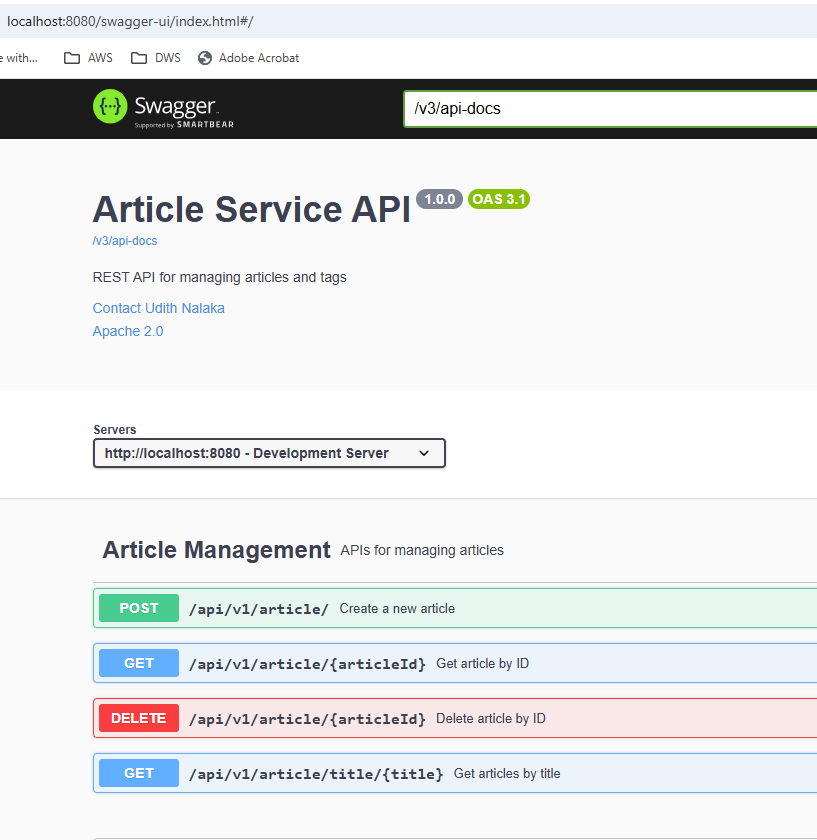
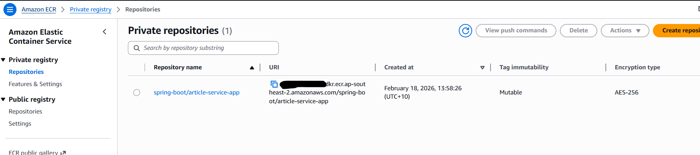

# Getting Started

## SpringBoot Application - Article Service

This application was initially created to address the codelity test requirement. Gradually added several technologies to 
the application to create a full end to end production grade micro service API.

Below are the tools, frameworks used in this application. 

* SpringBoot 3.5.0
* Java 21
* Junit5 / Mockito
* Integration tests with TestContainers
* Spring JPA
* H2 in memory database
* Docker containers (spring-boot app, postgres and redis)
* Global Exception handling with @RestControllerAdvice
* Redis cache layer
* Security - Auth0/ JWT
* Swagger documentation
* Postman  - functional test endpoints 
* Deploying to AWS (to AWS ECR)

## SQL 
* Refer to /resources/db/transactions.sql file for SQL solution for the transactions
   related question.

### Running the application

#### 1. with dev profile (configured for H2)
    mvn clean install -e
    mvn spring-boot:run "-Dspring-boot.run.profiles=dev"

#### 2. with docker containers (configured for Postgres)
    Note: please refer to 'Dockerizing the application' section

### test application

once application is running, a database named 'article' will be created with two tables.
Article and Tag. Tables will be empty as each app start will create a fresh copy of the database.

**Note:** I have used postman to save Article endpoint to insert to database and used the get endpoint to verify.
Postman screenshots attached below.

log into h2 console to verify. url: http://localhost:8080/h2-console/

#### Postman requests

* save article

* get article by id

* get article by title

## Dockerizing the application

* Dockerfile - has the base image with the java version to use at runtime. springboot app jar is copied to the docker 
               container workdir and the command to run the application.
* docker-compose - has the docker services to run and the configuration. It is configured to run Postgres database and
               the spring boot application as two separate docker containers which interacts with each other.

* commands to run the application with docker

      # 1. Clean everything (if containers running already)
      docker-compose down -v
      docker system prune -f
      
      # 2. Build the application
      mvn clean package -DskipTests
      
      # 3. Build and start with docker-compose
      docker-compose up -d --build
      
      # 4. Watch logs (optional)
      docker-compose logs -f
      
      # 5. Check if PostgreSQL is ready (optional)
      docker exec crud-postgres pg_isready -U postgres
      
      # 6. Check if app can reach postgres (optional)
      docker exec crud-app ping -c 3 postgres
      
      # 7. Test the application (optional)
      curl http://localhost:8080/actuator/health

      # 8. connect to postgres container to vew DB records
      docker exec -it articles-postgres psql -U postgres -d articledb

* Once the application and the postgres database are running
  * send 'save' requests through postman and retrieve details (getById, getByTitle). 
  * login to the database to check if the tables created and data inserted.

      
      docker exec -it articles-postgres psql -U postgres -d articledb
  

## Swagger Documentation

* add the following dependency to the pom.xml

        <dependency>
			<groupId>org.springdoc</groupId>
			<artifactId>springdoc-openapi-starter-webmvc-ui</artifactId>
			<version>2.8.15</version>
		</dependency>

* create the SwaggerConfig class with the OpenAPI information.

* Annotate the Controller with the relavent annotation.

And, thats it, Just run the application and navigate to

    http://localhost:8080/swagger-ui/index.html

## Auth0/ JWT Authentication

* Auth0.com - API and Application created in Auth0 dev tenant with
  * scopes: readarticle, deletearticle, createarticle
  * audience: https//article-service-api
  
* below dependencies added for security

      spring-boot-starter-security    
      spring-boot-starter-oauth2-resource-server

* application.yml changes

      spring:  
        security:
          oauth2:
            resourceserver:
              jwt:
                issuer-uri: https://dev-udith-nalaka.au.auth0.com/
                audiences: https//article-service-api

* SecurityFilterChain configured (@Bean) to bypass authenticating the swagger url's  and to validate the JWT token with AUDIENCE.

* method level secutiy enabled to Authorize the method calls using SCOPES

      @PreAuthorize("hasAuthority('SCOPE_readarticle')")

## Deploying to AWS

Assumptions:
* docker image created locally for you application.

      docker build -t <your-spring-boot-app> .

* Aws account is available and a IAM user is created with Access keys.
* Access keys inserted into aws config in local machine, so we can run the aws service commands from local machine.

### getting access to ECR and pushing a image from local machine to AWS ECR using a profile

1)  getting access to ECR (need to setup the aws config with a profile.)

        aws ecr get-login-password --region ap-southeast-2 --profile <your-aws-profile> | docker login --username AWS --password-stdin <aws-account-id>.dkr.ecr.ap-southeast-2.amazonaws.com

2) create a repository in AWS ECR to hold the image

       aws ecr create-repository --repository-name spring-boot/article-service-app --region ap-southeast-2 --profile <your-aws-profile>

3) tag the image

       docker tag articleservice-app:latest <aws-account-id>.dkr.ecr.ap-southeast-2.amazonaws.com/spring-boot/article-service-app

4) push image to ECR

       docker push <aws-account-id>.dkr.ecr.ap-southeast-2.amazonaws.com/spring-boot/article-service-app:latest

  Once image is pushed to ECR, it should be visible in AWS ECR console

  
  
