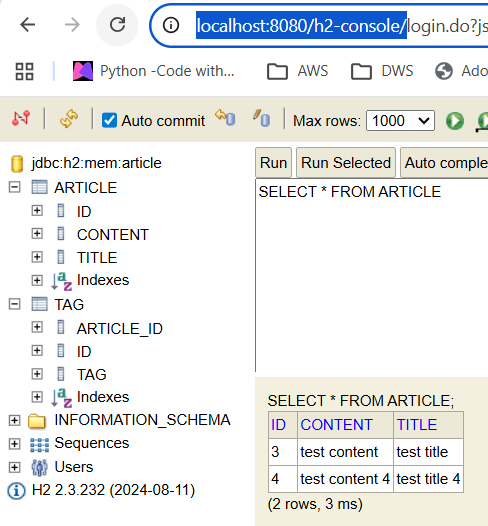
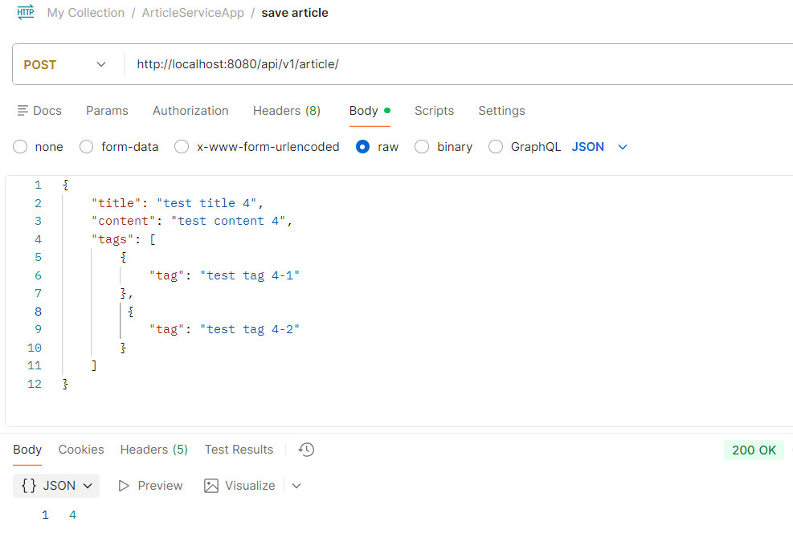
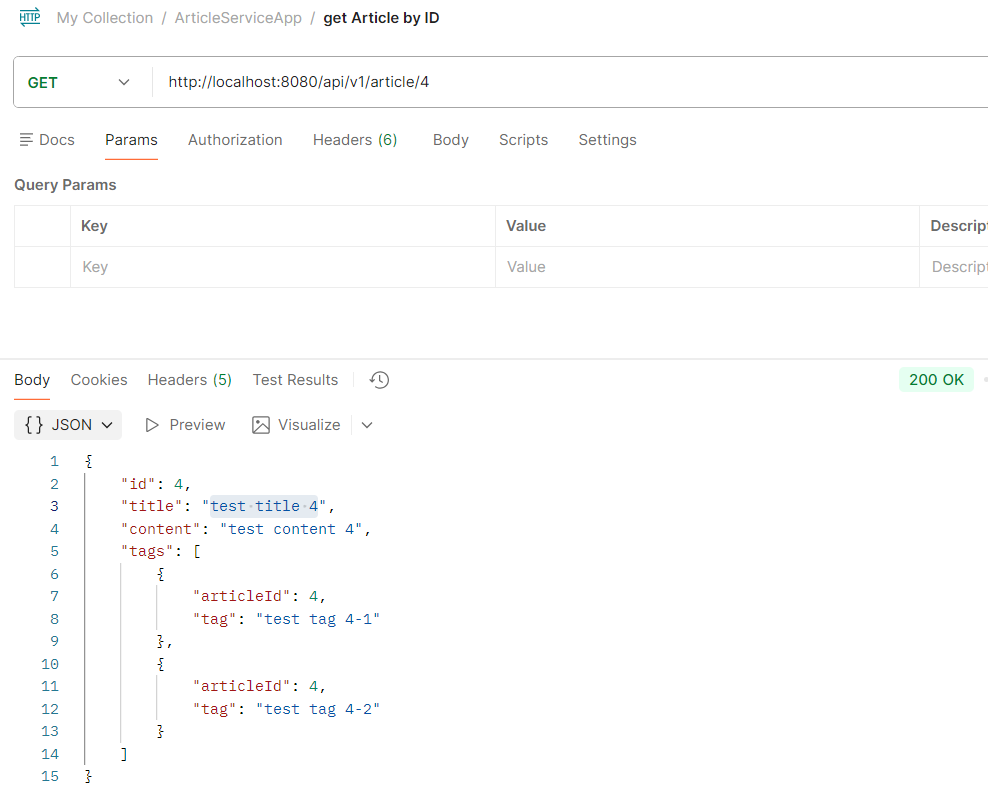
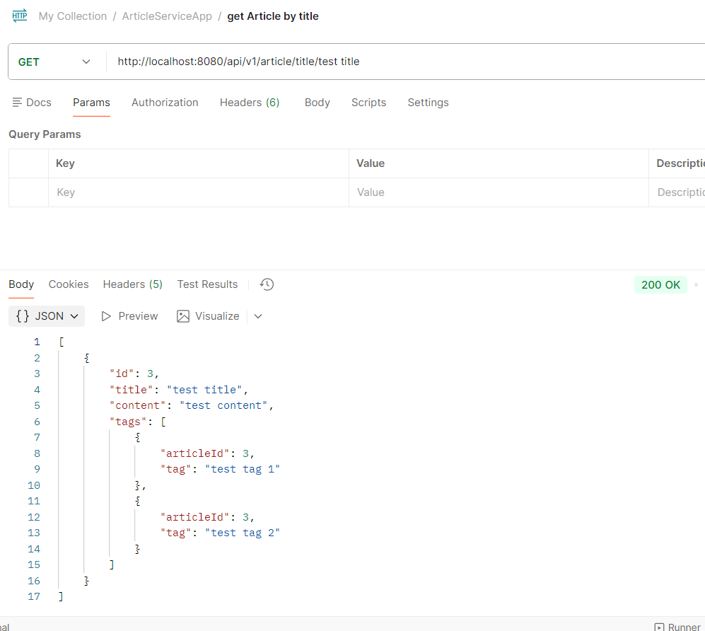
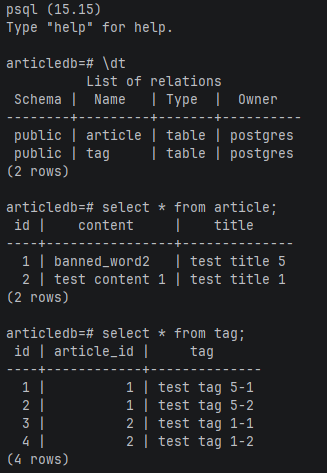

# Getting Started

## SpringBoot Application - Article Service

* SpringBoot 3.5.0
* Java 21
* Junit5 / Mockito
* Spring JPA
* H2 in memory database
* Docker containers (spring-boot app and postgres)
* Global Exception handling with @RestControllerAdvice

## SQL 
* Refer to /resources/db/transactions.sql file for SQL solution for the transactions
   related question.

### Running the application

#### 1. with dev profile (configured for H2)
    mvn clean install -e
    mvn spring-boot:run "-Dspring-boot.run.profiles=dev"

#### 2. with docker containers (configured for Postgres)
    Note: please refer to 'Dockerizing the application' section

### test application

once application is running, a database named 'article' will be created with two tables.
Article and Tag. Tables will be empty as each app start will create a fresh copy of the database.

**Note:** I have used postman to save Article endpoint to insert to database and used the get endpoint to verify.
Postman screenshots attached below.

log into h2 console to verify. url: http://localhost:8080/h2-console/

#### Postman requests

* save article

* get article by id

* get article by title

## Dockerizing the application

* Dockerfile - has the base image with the java version to use at runtime. springboot app jar is copied to the docker 
               container workdir and the command to run the application.
* docker-compose - has the docker services to run and the configuration. It is configured to run Postgres database and
               the spring boot application as two separate docker containers which interacts with each other.

* commands to run the application with docker

      # 1. Clean everything (if containers running already)
      docker-compose down -v
      docker system prune -f
      
      # 2. Build the application
      mvn clean package -DskipTests
      
      # 3. Build and start with docker-compose
      docker-compose up -d --build
      
      # 4. Watch logs (optional)
      docker-compose logs -f
      
      # 5. Check if PostgreSQL is ready (optional)
      docker exec crud-postgres pg_isready -U postgres
      
      # 6. Check if app can reach postgres (optional)
      docker exec crud-app ping -c 3 postgres
      
      # 7. Test the application (optional)
      curl http://localhost:8080/actuator/health

      # 8. connect to postgres container to vew DB records
      docker exec -it articles-postgres psql -U postgres -d articledb

* Once the application and the postgres database are running
  * send 'save' requests through postman and retrieve details (getById, getByTitle). 
  * login to the database to check if the tables created and data inserted.

      
      docker exec -it articles-postgres psql -U postgres -d articledb
  

