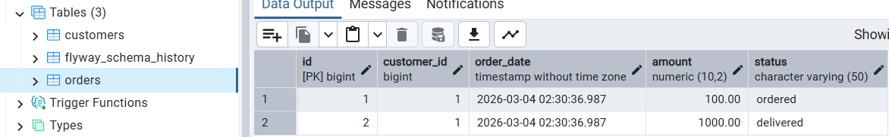
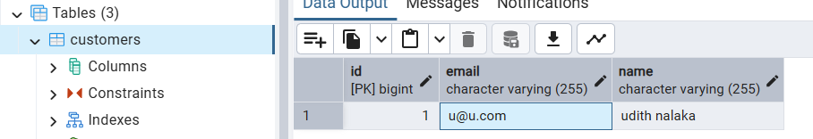
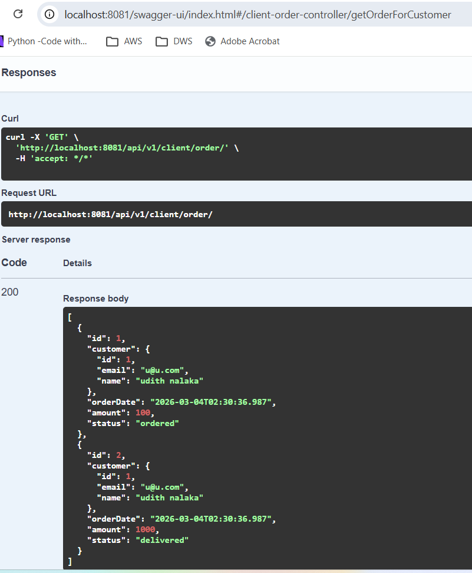
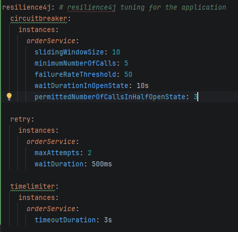
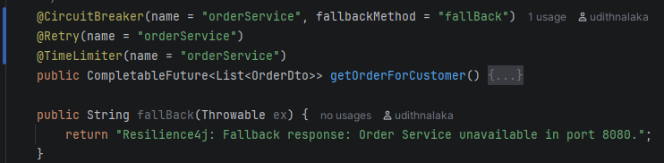

# Spring Boot app  - Client Order Service

A simple spring application to act as the client service to call another REST service 
"CustomerOrders" (GIT repo: https://github.com/udithnalaka/spring-boot-apps/tree/master/CustomerOrders)

### Technologies used

* SpringBoot 3.5
* Java 21
  * CompletableFuture
* RestClient
* Resilience4j
  * Circuit breaker
  * Retry
  * Timeout
  * Fallback
* Swagger

### Run the application

1. run the downstream service (CustomerOrders)
   
   refer to the readme.md file (https://github.com/udithnalaka/spring-boot-apps/blob/master/CustomerOrders/README.md)

2. create some dummy data in the database

   

   

3. build and run the client application (this app)

       mvn clean install
       mvn spring-boot:run

4. from Swagger, access the endpoint and should be able to get the response with the two orders available in the downstream service.

    

### Resilience4j configuration

 1) application.yml: below configuration is for resilience4j setup

    

 2) Service class (ClientOrderServiceImpl)

   
