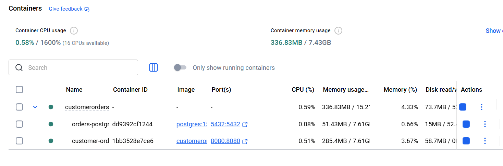
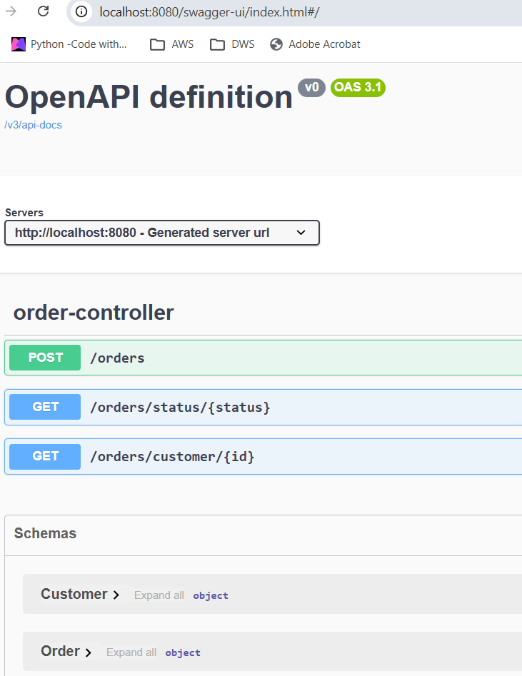

# Customer Order Service

A simple spring application created mainly to refresh about table indexes and using Hibernate/JPA annotation
for creating the indexes and using Flyway to auto populate the database on app startup.

### Technologies used

* SpringBoot 3.5
* Java 21
* Spring JPA
* Postgres
* Docker
* Database Indexes
* Flyway
* Swagger

### Indexes created

    CREATE INDEX idx_orders_customer_id ON orders(customer_id);
    CREATE INDEX idx_orders_customer_date ON orders(customer_id, order_date);
    CREATE INDEX idx_orders_status ON orders(status);
    CREATE INDEX idx_customer_email ON customers(email);

### Example queries that use indexes

* Fetch recent orders for a customer

        SELECT * FROM orders
        WHERE customer_id = 1
        ORDER BY order_date DESC;
    
        Uses:
        - idx_orders_customer_date

* Fetch orders by status

        SELECT * FROM orders 
        WHERE status = 'PENDING';

        Uses:
        - idx_orders_status

* Join customer → orders

      SELECT o.*
      FROM orders o
      JOIN customers c ON c.id = o.customer_id
      WHERE c.email = 'udith@example.com';

      Uses:
      - idx_orders_customer_id
      - idx_customer_email

### Run the application

        mvn clean install
        
        docker compose up --build

### Containers running

### Test - Swagger

