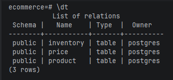
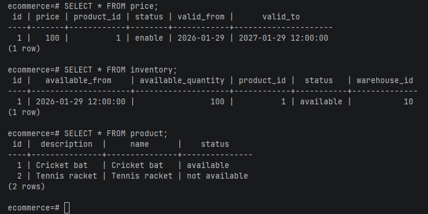
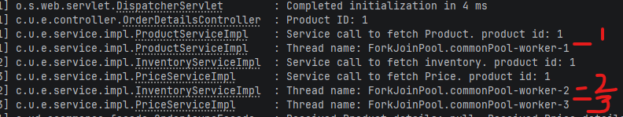

# Getting Started
SpringBoot application for a simple Order service using CompletableFuture for Async calls.
This will execute the CompletableFuture wrapped Object in different threads and then combine the results before returning back.

### Reference Documentation

TODO

### Maven Parent overrides

Due to Maven's design, elements are inherited from the parent POM to the project POM.
While most of the inheritance is fine, it also inherits unwanted elements like `<license>` and `<developers>` from the
parent.
To prevent this, the project POM contains empty overrides for these elements.
If you manually switch to a different parent and actually want the inheritance, you need to remove those overrides.

### H2 in-memory Database setup 
* below config needed in application.yml

         spring:
            h2:
                console:
                    path: /h2-console
                    enabled: true
            datasource:
                url: jdbc:h2:mem:ecommerce
                driver-class-name: org.h2.Driver

* need the h2 and data-jpa dependencies in pom.xml

### Application tesing

  build and run the application

     mvn clean install
     mvn spring-boot:run

***
Application is configured for H2 in-memory database OR to use a postgresql database running as a docker container.
both document below in respective sections.(use one at a time)

## H2 Database
  dont forget to uncomment the h2: section in application.yml file if connecting to H2 database and comment the postgres related config.
#### Open H2 console
 * Database console can be access from  - http://localhost:8080/h2-console/

 * Tables will be created and need to insert the test data.

## Postgres Database

 * run docker compose to bring up the postgres docker container (configured under docker-compose.yml)
      
        docker compose up -d
 * check if the postgres container running
        
        docker ps
 * use a DB client or use the following docker command to connect to the postgres database. make sure the application is running. 
    'ecommerce' is the database schema name.

          docker exec -it my-postgres psql -U postgres -d ecommerce
 * to check the available tables type '\dt'
        
    

 * query the tables and check the values inserted properly

    

* navigate to the endpoint to get product details - http://localhost:8080/api/v1/products/1

## Multi threads running for the three separate services

