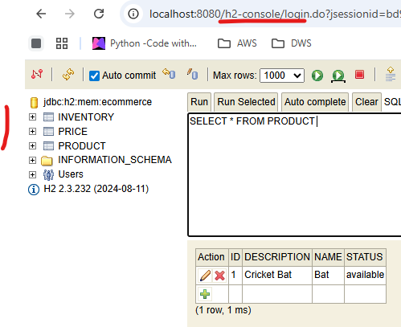
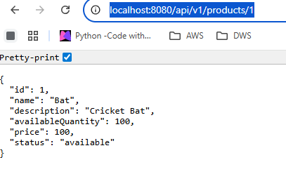

# Getting Started
SpringBoot application for a simple Order service using CompletableFuture for Async calls.
This will execute the CompletableFuture wrapped Object in different threads and then combine the results before returning back.

### Reference Documentation

TODO

### Maven Parent overrides

Due to Maven's design, elements are inherited from the parent POM to the project POM.
While most of the inheritance is fine, it also inherits unwanted elements like `<license>` and `<developers>` from the
parent.
To prevent this, the project POM contains empty overrides for these elements.
If you manually switch to a different parent and actually want the inheritance, you need to remove those overrides.

### H2 in-memory Database setup 
* below config needed in application.yml

         spring:
            h2:
                console:
                    path: /h2-console
                    enabled: true
            datasource:
                url: jdbc:h2:mem:ecommerce
                driver-class-name: org.h2.Driver

* need the h2 and data-jpa dependencies in pom.xml

### Application tesing

  build and run the application

     mvn clean install
     mvn spring-boot:run

#### Open H2 console
 * Database console can be access from  - http://localhost:8080/h2-console/

 * Tables will be created and need to insert the test data.

 * navigate to the endpoint to get product details - http://localhost:8080/api/v1/products/1

 
