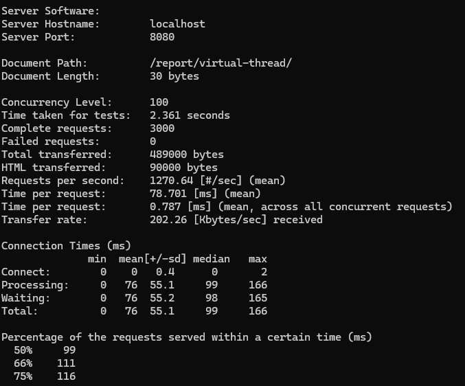

# Getting Started

SpringBoot application to learn about various threads used for executing concurrent requests.

### Scenario:
     sending 300 requests concurrently to the rest controller

Three Thread types are considered.

1. Main thread

   tomcat concurrent threads by default is 200. So, out of 300 requests, 200 will be processed by the tomcat's available 200 threads.
   Other 100 requests will be waiting to be processed depending on the freed up threads.

2. Platform thread

    Configured to use 5 dedicated threads from platform threads. So, 5 separate threads will be allocated for the Executor.

3. Virtual thread

   Virtual thread will be created for each task (request) by the JVM (managed by JVM) to get the work done. Thus, not holding the platform thread until the full task is completed.
   A virtual thread will be mounted/ unmounted to/from a platform thread to get the task done efficiently.

   if a virtual thread is waiting for a database response, it gets unmounted from the platform thread. 
   This allows another virtual thread to use the platform thread and do the work. once the database response is available, 
    a virtual thread will be mounted to a platform thread to return the response. virtual threads are good for IO bound scenarios.

### Testing Results

    Apache Benchmark is used to send multiple requests to the endpoint concurrently to check the performance.
    
    ab -n 3000 -c 100 -m GET http://localhost:8080/report/single-thread/
    ab -n 3000 -c 100 -m GET http://localhost:8080/report/platform-thread/
    ab -n 3000 -c 100 -m GET http://localhost:8080/report/virtual-thread/
    

below is a output from the benchmark results

   

      ab -n 3000 -c 100 -m GET http://localhost:8080/report/virtual-thread/

      This is ApacheBench, Version 2.3 <$Revision: 1923142 $>
      Copyright 1996 Adam Twiss, Zeus Technology Ltd, http://www.zeustech.net/
      Licensed to The Apache Software Foundation, http://www.apache.org/
      
      Benchmarking localhost (be patient)
      Completed 300 requests
      Completed 600 requests
      Completed 900 requests
      Completed 1200 requests
      Completed 1500 requests
      Completed 1800 requests
      Completed 2100 requests
      Completed 2400 requests
      Completed 2700 requests
      Completed 3000 requests
      Finished 3000 requests
      
      
      Server Software:
      Server Hostname:        localhost
      Server Port:            8080
      
      Document Path:          /report/virtual-thread/
      Document Length:        30 bytes
      
      Concurrency Level:      100
      Time taken for tests:   2.361 seconds
      Complete requests:      3000
      Failed requests:        0
      Total transferred:      489000 bytes
      HTML transferred:       90000 bytes
      Requests per second:    1270.64 [#/sec] (mean)
      Time per request:       78.701 [ms] (mean)
      Time per request:       0.787 [ms] (mean, across all concurrent requests)
      Transfer rate:          202.26 [Kbytes/sec] received
      
      Connection Times (ms)
      min  mean[+/-sd] median   max
      Connect:        0    0   0.4      0       2
      Processing:     0   76  55.1     99     166
      Waiting:        0   76  55.2     98     165
      Total:          0   76  55.1     99     166
      
      Percentage of the requests served within a certain time (ms)
      50%     99
      66%    111
      75%    116
      80%    119
      90%    136
      95%    154
      98%    159
      99%    162
      100%    166 
